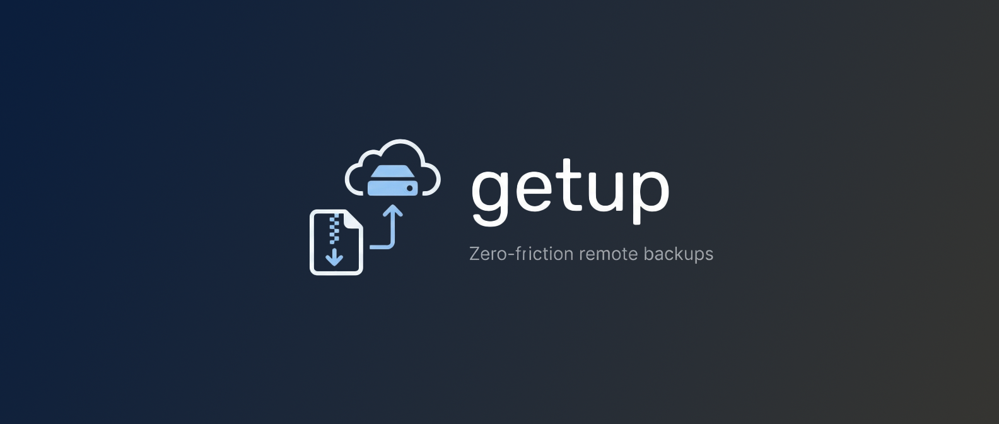

A zero-friction tool for streaming compressed remote backups that leverages your existing SSH environment to eliminate redundant configuration.

## Features

- **Streaming Compression**: Uses `tar` and `zstd` on the remote server to minimize bandwidth.
- **SSH Native**: Leverages your existing `~/.ssh/config` and `~/.ssh/known_hosts`.
- **Exclusion Support**: Easily exclude specific directories or files using the `!` prefix.
- **Real-time Stats**: Shows write speed and total progress during the transfer.
- **Optional Encryption**: Encrypt your backups with a password using [age](https://github.com/FiloSottile/age).

## Installation

You can bootstrap **getup** with a single command. This script will detect your OS and CPU (`amd64`/`arm64`), download the correct binary and install it to `/usr/local/bin/getup`.

```bash
curl -sL https://src.w2k.sh/getup/install.sh | sh
```

### Binary
Download the latest prebuilt version for your platform from the [releases](https://github.com/coalaura/getup/releases/latest) page.

### Build from source
Requires Go 1.25+.

```bash
git clone https://github.com/coalaura/getup.git
cd getup
go build -o getup .
```

## Configuration

The tool looks for a YAML configuration file at `~/.config/getup.yml`.

```yaml
password: "" # Optional password to encrypt backups using age
servers:
  - name: web-server          # Matches entry in ~/.ssh/config
    target: /local/backups    # Local directory to store archives
    files:
      - /etc/nginx            # Include directory
      - /var/www
      - "!/var/www/cache"     # Exclude directory (prefix with !)
      - /root/.bashrc         # Include specific file
```

## Usage

Simply run the binary. It will iterate through all servers defined in your config:

```bash
getup
```

### Output Format
Archives are saved using the format: `{server_name}-{timestamp}.tar.zst`

## Requirements

- **Local**: `getup` binary.
- **Remote**: `bash`, `tar`, and `zstd` must be available in the shell path.
