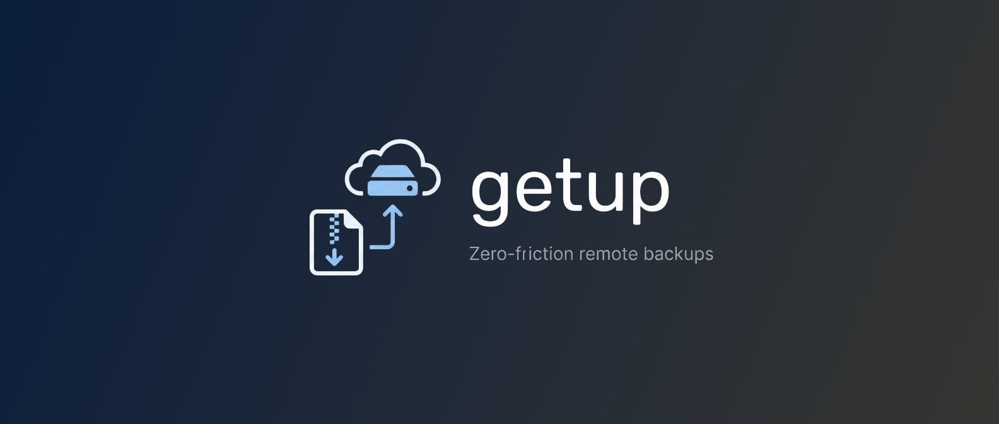

A zero-friction tool for streaming compressed remote backups that leverages your existing SSH environment to eliminate redundant configuration.

## Features

- **Streaming Compression**: Uses `tar` and `zstd` on the remote server to minimize bandwidth.
- **SSH Native**: Leverages your existing `~/.ssh/config` and `~/.ssh/known_hosts`.
- **Multiple Tasks per Host**: Define several backup jobs against the same SSH host, each with its own `name`, files and pre/post scripts.
- **Exclusion Support**: Easily exclude specific directories or files using the `!` prefix.
- **Real-time Stats**: Shows write speed and total progress during the transfer.
- **Optional Encryption**: Encrypt your backups with a password using [age](https://github.com/FiloSottile/age).

## Installation

You can bootstrap **getup** with a single command. This script will detect your OS and CPU (`amd64`/`arm64`), download the correct binary and install it to `/usr/local/bin/getup`.

```bash
curl -sL https://src.w2k.sh/getup/install.sh | sh
```

### Binary
Download the latest prebuilt version for your platform from the [releases](https://github.com/coalaura/getup/releases/latest) page.

### Build from source
Requires Go 1.25+.

```bash
git clone https://github.com/coalaura/getup.git
cd getup
go build -o getup .
```

## Configuration

The tool looks for a YAML configuration file at `~/.config/getup.yml`.

```yaml
password: "" # Optional password to encrypt backups using age
tasks:
  - server: web-server            # Matches entry in ~/.ssh/config
    name: web-files               # Used for the archive filename (falls back to server if omitted)
    target: /local/backups        # Local directory to store archives
    pre:                          # Optional commands to run before backup
      - "systemctl stop nginx"
      - "docker pause myapp"
    post:                         # Optional commands to run after backup
      - "docker unpause myapp"
      - "systemctl start nginx"
    files:
      - /etc/nginx                # Include directory
      - /var/www
      - "!/var/www/cache"         # Exclude directory (prefix with !)
      - /root/.bashrc             # Include specific file

  - server: web-server            # Same host, different job
    name: web-mysql
    target: /local/backups
    pre:
      - "systemctl stop mysql"
    post:
      - "systemctl start mysql"
    files:
      - /var/lib/mysql
```

| Field    | Required | Description |
|----------|----------|-------------|
| `server` | yes      | Hostname as defined in `~/.ssh/config` |
| `name`   | no       | Job label used in the archive filename; defaults to `server` |
| `target` | yes      | Local directory for the resulting archive |
| `files`  | yes      | Paths to include; prefix with `!` to exclude |
| `pre`    | no       | Commands run on the remote host before the backup |
| `post`   | no       | Commands run on the remote host after the backup |

## Usage

Simply run the binary. It will iterate through all tasks defined in your config:

```bash
getup
```

### Output Format
Archives are saved using the format: `{name}-{timestamp}.tar.zst`

If `name` is omitted, `server` is used instead. With a password set, the extension becomes `.tar.zst.age`.

## Requirements

- **Local**: `getup` binary.
- **Remote**: `bash`, `tar`, and `zstd` must be available in the shell path.
